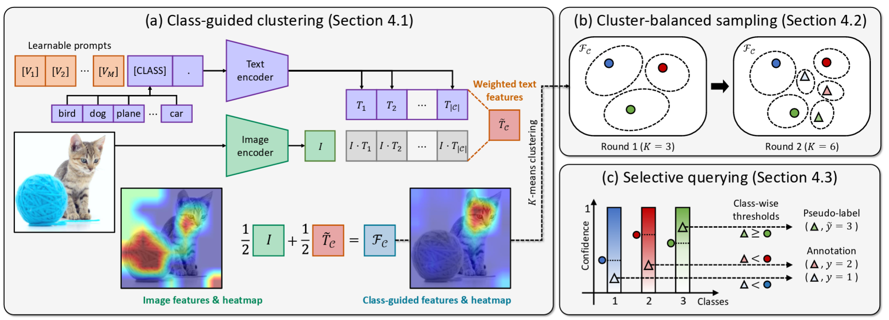

# Active Prompt Learning with Vision-Language Model Priors
This repository is the official implementation of ["Active Prompt Learning with Vision-Language Model Priors"](https://arxiv.org/abs/2411.16722)



## Abstract
Vision-language models (VLMs) have demonstrated remarkable zero-shot performance across various classification tasks. Nonetheless, their reliance on hand-crafted text prompts for each task hinders efficient adaptation to new tasks. While prompt learning offers a promising solution, most studies focus on maximizing the utilization of given few-shot labeled datasets, often overlooking the potential of careful data selection strategies, which enable higher accuracy with fewer labeled data. This motivates us to study a budget-efficient active prompt learning framework. Specifically, we introduce a class-guided clustering that leverages the pre-trained image and text encoders of VLMs, thereby enabling our cluster-balanced acquisition function from the initial round of active learning. Furthermore, considering the substantial class-wise variance in confidence exhibited by VLMs, we propose a budget-saving selective querying based on adaptive class-wise thresholds. Extensive experiments in active learning scenarios across nine datasets demonstrate that our method outperforms existing baselines.

## How to Install
We sincerely appreciate the [PCB repository](https://github.com/kaist-dmlab/pcb) for offering an excellent base code. For details, the code is based on the [CoOp repository](https://github.com/KaiyangZhou/CoOp) and the powerful toolbox [Dassl.pytorch](https://github.com/KaiyangZhou/Dassl.pytorch). To simply usage, PCB integrates the `dassl` directory into our directory. You follow below commands: 

``` bash
conda create -n pcb python=3.10 
conda activate pcb 
pip install -r requirements.txt 
```

Next, you should build on the datasets - follow [DATASETS.md](DATASETS.md) to install the datasets.

## How to Run
To run the code, you need to look into `scripts/alvlm/main.sh`. In this file, you must set parameter `DATA` as the directory path that datasets are stored. After then, you can run the code by following command. 
```bash
CUDA_VISIBLE_DEVICES=XX sh scripts/alvlm/main.sh [DATASET NAME] [MODEL NAME] [AL METHOD] [SEED NUMBER] [MODE] 
```
- **DATASET NAME** $\in$ [oxford_flowers, dtd, oxford_pets, caltech101, stanford_cars, eurosat, fgvc_aircraft]
- **MODEL NAME** $\in$ [RN50, RN101, vit_b32, vit_b16]
- **AL METHOD** $\in$ [random, entropy, coreset, badge, pcb, cb, cbsq]
- **SEED**: integer 
- **MODE**: This is for description augmentation $\in$ [none, AS, AE]

## Cite
Please cite our paper if you use the model or this code in your own work:
```
@inproceedings{kim2025active,
  title={Active Prompt Learning with Vision-Language Model Priors},
  author={Hoyoung Kim and Seokhee Jin and Changhwan Sung and Jaechang Kim and Jungseul Ok},
  booktitle=TMLR,
  year={2025},
  url={https://arxiv.org/abs/2411.16722}
}
```
